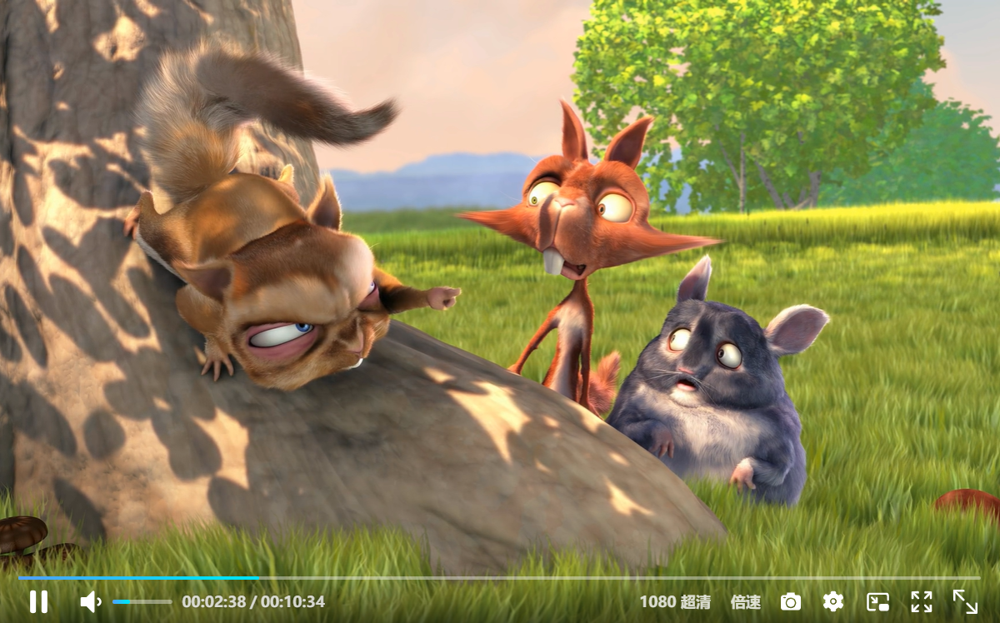

# vue3-video-player

<h1 align="center">Vue3-Video-Player</h1>

一个适应 Vue3 的视频播放组件

## 主要功能

- [x] hls 播放支持清晰度切换
- [x] 支持音频切换
- [x] 支持快捷键操作
- [x] 支持倍速播放设置
- [x] 支持镜像画面设置
- [x] 支持关灯模式设置
- [x] 支持画中画模式播放
- [x] 支持全屏/网页全屏播放
- [x] 支持从固定时间开始播放
- [x] 支持 hls 视频流播放，支持直播
